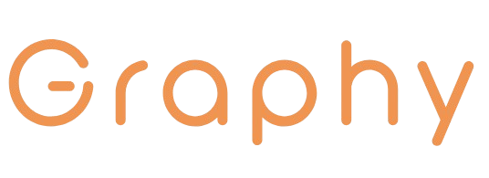

# Graphy v1

payment is a real-time GraphRAG (Graph Retrieval-Augmented Generation) application that leverages the power of [LangChain](https://python.langchain.com/), [Neo4j](https://neo4j.com/), and OpenAI's GPT models to extract knowledge from documents and enable natural language querying over a graph database.

